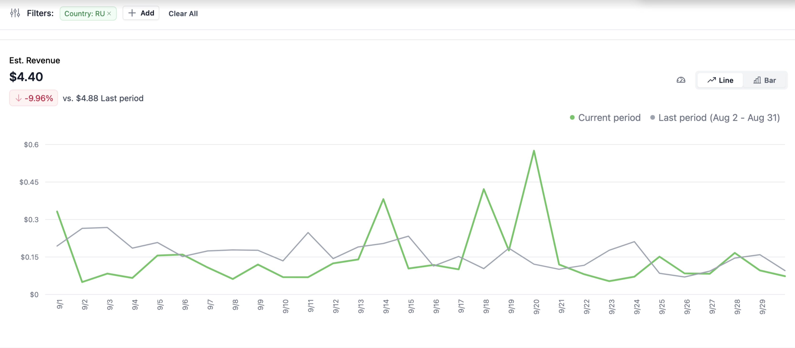
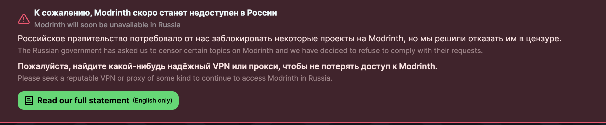

Вчера, нас поставили в положение, в котором не должно оказаться ни одно сообщество. Российское правительство связалось с нами и потребовало немедленно удалить четыре ЛГБТК+ проекта с Modrinth. И если мы не согласимся, то весь сайт был бы заблокирован в России целиком.

У нас был всего день на решение. Вся команда Modrinth провела 5 часов, взвешивая наши опции. Одна хуже другой:

- Заблокировать весь Modrinth целиком более чем миллиону российских пользователей
- Напрямую повлиять на жизни авторов: и собственно авторов-россиян, и тех, чьи работы популярны у россиян
- Согласиться с запросами цензоров, которые идут против нашего достоинства

Деньги не были фактором нашего решения. Мы теряем деньги на контенте, который скачивают российские пользователи, но мы всё равно продолжаем поддерживать их. Для нас были значимы последствия для людей.

_Доход от рекламы, показанной в России, за август._

В итоге, мы пришли к выводу, что мы выберем путь „наименьшего зла“. Мы были убеждены, что удалить те четыре проекта будет меньшей цензурой, чем если все пользователи из России утратят доступ к Modrinth. Но такое решение, сделанное под давлением и в отсутствие времени, было близоруким. Оно не соответствует нашим ценностям, нашей поддержке ЛГБТК+ сообщества и нашей позиции против цензуры.

Для полной ясности: решение подчиниться, даже кратковременно, было ошибкой. И мы очень просим за него прощения.

## Что теперь

Мы решили откатить прошлое решение. Все четыре проекта будут восстановлены.

Наши ценности не подлежать обсуждению. Идя дальше, мы не будем подчиняться нарушающим их требованиям никаких правительственных организаций. Modrinth существует, чтобы сделать моддинг игр открытым и доступным каждому, и мы следуем этой цели.

Мы знаем, что рано или поздно Modrinth будет заблокирован российским правительством, но мы постараемся сделать всё, что в наших силах, чтобы подготовить к этому российских пользователей. Мы оповестим их о надвигающемся бане и укажем как они могут сохранить доступ к веб-сайту.

## Последствия для авторов

Хоть этот откат и не повлияет на авторские отчисления напрямую, так как Modrinth не получали значимого дохода от российских пользователей, мы знаем, что он возымеет иное влияние на авторов.

Эта ситуация может подорвать Вашу жизнь и труды, если Вы - из России или у Вас в России большая публика. Это болезненно и несправедливо. Мы глубоко сожалеем о происходящем, и мы продолжим делать всё возможное, чтобы Вам помочь.

## Наш долг

Ото всей нашей команды: мы просим прощения. Мы позволили срочности и давлению увести нас к решению, которое не отражает того, кто мы и за что мы ратуем. Мы хотели бы быть искренни в том, что совершили ошибку и что возьмём ответственность за её исправление.

Наша цель остаётся прежней: поддерживать авторов, сохранять моддинг доступным и обеспечивать безопасное и гостеприимное место для каждого.

Спасибо за то, что призываете нас к ответственности. Спасибо за то, что доверяете, что мы исправимся. И мы надеемся, вы сможете продолжить нас поддерживать.

Если Вы в опасности или вам нужна информация, примите во внимание [Rainbow Railroad](https://www.rainbowrailroad.org/) - организацию, призванную помочь ЛГБТК+-людям спастись от угнетения.

💚 The Modrinth Team

(translated from [English](standing-by-our-values.md))
